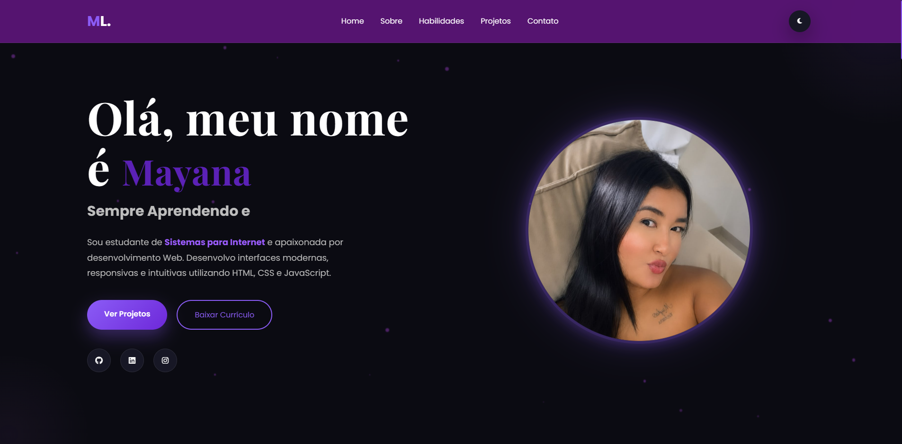

# 💜 Portfólio Pessoal - Mayana Lima

Bem-vindo ao meu portfólio! Este projeto foi desenvolvido para apresentar minhas habilidades como desenvolvedora Front-end, além dos projetos que venho criando durante meus estudos.

## 🚀 Tecnologias Utilizadas

- HTML5
- CSS3
- JavaScript
- Font Awesome
- Google Fonts

## ✨ Funcionalidades

- 🎨 Design moderno e responsivo
- 🌙 Modo claro e escuro
- ⌨️ Efeito de digitação
- 📱 Layout adaptado para dispositivos móveis
- ⬆️ Botão "Voltar ao topo"
- 📄 Download do currículo
- 📂 Seção de projetos
- 📬 Área de contato

## 🌐 Acesse o projeto

🔗 **Site:** https://mayanalimaaa.github.io/Site-Mayana.Dev/

## 📷 Preview

> Adicione aqui uma imagem do seu portfólio.

```html

```

## 👩‍💻 Sobre mim

Sou estudante de **Tecnologia em Sistemas para Internet** pela UniCesumar e apaixonada por desenvolvimento Web. Estou sempre aprendendo novas tecnologias e buscando criar interfaces modernas, intuitivas e responsivas.

## 📬 Contato

- GitHub: https://github.com/mayanalimaaa
- LinkedIn: *(adicione o link do seu LinkedIn)*
- E-mail: *(adicione seu e-mail, se desejar)*

---

⭐ Se gostou do projeto, deixe uma estrela no repositório!
